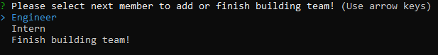

# TEAM PROFILE GENERATOR
## Version 1.0
## Description
This app is a Node.js command-line application that takes in information about employees and generates an HTML webpage that displays summaries for each person. The app also tests user classes making the code maintainable.

## Table of Contents
* [License](#license)
* [Installation](#installation)
* [Test](#test)
* [Usage](#usage)
* [Credits](#credits)

## License

## Installation
To install this app you need to have node installed in your system. Once installed you can clone the repository using the link _https://github.com/jamwalab/teamProfileGenerator.git_.

Once the repository is cloned, using bash terminal, move to the app repository. Once there install the required npm modules suing the command _"npm install"_. After the npm modules are installed, run the app using the command _"node index"_. App will ask you a series of question, answering them will generate the HTML page with team details.

## Test
This app uses [Jest](https://jestjs.io/) to test classes. There are four test suits created, as listed below:
* Employee.test.js
* Engineer.test.js
* Intern.test.js
* Manager.test.js

To run all tests, type _"npm test"_

## Usage
To run this app type _"node index"_. On execution it will first ask for details of the Team Manager. Details required will include name, id, email and office number. Once all the details are provided, you will have three options to select from as seen below:

Selecting an engineer will require you to provide below details:
* Name
* ID
* Email
* GitHub username

Selecting an Intern will require you to provide below details:
* Name
* ID
* Email
* School name

You can continue to add any number of engineers and interns. Once all the engineers and intern details are added, select _"Finish building team"_ in the selection option. Once selected you should receive a success message for the newly created index.html file and the style.css being copied.

Newly created html file can will be available at [CLICK HERE](./dist/index.html)

A detailed run through of the app is available at [Link to Video](https://www.youtube.com/watch?v=nCedRd6TVVg)

## Credits
#### NPM Modules
* [Inquirer](https://www.npmjs.com/package/inquirer)
* [Jest](https://jestjs.io/)

#### Users
* Abhishek Jamwal - [GitHub](https://github.com/jamwalab)